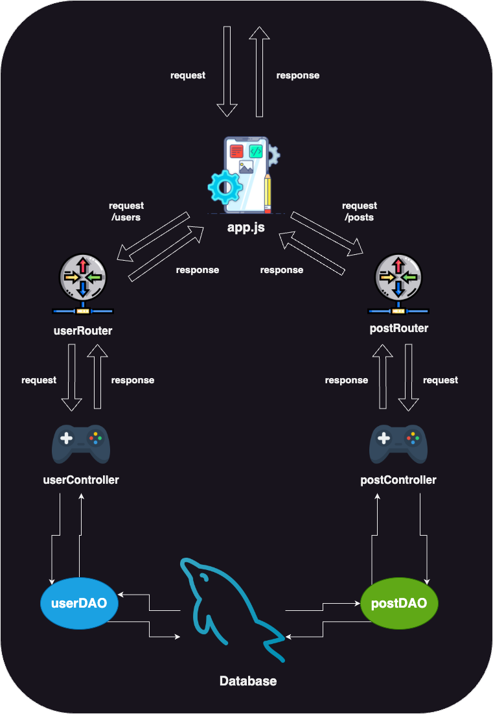

## 🚀 Intro
---

```
커뮤니티 서비스를 위한 백엔드 서버 프로젝트입니다.
```

<br>

##### Demo

__[🔗 커뮤니티 서비스 데모 영상](https://youtu.be/BByaBgOgieg)__


<br>


#### Frontend Servers

__[🔗 Frontend Server - Vanilla](https://github.com/100-hours-a-week/5-ian-jeong-community-frontend-vanilla)__    
__[🔗 Frontend Server - React](https://github.com/100-hours-a-week/5-ian-jeong-community-front-react)__


<br>

##### Tech Stacks

[](https://developer.mozilla.org/en-US/docs/Web/JavaScript)   [](https://expressjs.com/)


##### Dev Env

[](https://www.apple.com/macos/big-sur/) [](https://code.visualstudio.com/)


<br>


<br><br><br><br><br>

## 🗂️ Directory Structure
---

```javascript
community-backend-express
|
| --- app.js  // express 앱의 진입점입니다.
| --- global.js  // 백엔드, 프론트 서버의 IP와 port 번호를 전역변수로 관리합니다.
| --- routes
|        |
|        | --- userRouter.js  // 유저 관련 요청 라우터
|        | --- postRouter.js  // 게시글 관련 요청 라우터
|
| --- controllers
|        |
|        | --- userController.js  // 유저 관련 요청-응답 컨트롤러
|        | --- postController.js  // 게시글 관련 요청-응답 컨트롤러
|
| --- models
|        |
|        | --- validateUtil.js  // 검증 유틸
|        | --- repository  
|                 |
|                 | --- dbConnection.js  // 데이터베이스 커넥션 모듈
|                 | --- userDAO.js  // 데이터베이스에 있는 유저 데이터 접근하게 해주는 DAO
|                 | --- postDAO.js  // 데이터베이스에 있는 게시글 데이터 접근하게 해주는 DAO
```


<br><br><br><br><br>


## 🏯 Architecture
---




<br><br>


```
유저에 관한 API와 게시글에 관한 API로 나눠질 수 있습니다.
라우터를 통해 타겟 컨트롤러에 도달할 수 있습니다. 
컨트롤러는 DAO 모듈을 활용해서 데이터베이스에 접근합니다.
```

<br>

#### ✅ Request & Response
```
요청 & 응답의 프로세스를 살펴보겠습니다.
```

__"/users"__ 로 시작하는 요청은 유저 컨트롤러로 향하게 됩니다.    
__"/posts"__ 로 시작하는 요청은 게시글 컨트롤러로 향하게 됩니다.

각각 알맞은 컨트롤러에 진입하면 요청에 응하기 위해 데이터베이스에 접근합니다.
이 때, 컨트롤러가 직접 접근하는 것이 아닌 DAO (Data Access Object)라는 모듈을 통해서 간접적으로 접근합니다.
컨트롤러는 DAO를 통해서 데이터베이스의 순수 데이터를 받을 수 있고 요청에 알맞은 로직을 실행한 뒤 응답을 보냅니다.

이렇게 함으로써 요청별 __라우팅의 책임__, __요청에 대해서 필요한 로직 수행 책임__, __데이터 베이스 접근 책임__ 으로 분리시킬 수 있습니다.

<br><br>


```
위 사진은 데이터베이스에 적용한 ERD 입니다.
```

__- 세션 테이블__
    제공받은 모듈을 통해서 세션 저장소를 데이터베이스에 적용하면 유저의 별다른 테이블 생성없이 알아서 생성됩니다.
    <br>

__- 유저 테이블__
    유저의 데이터를 칼럼으로 지닙니다.
    데이터베이스에서 유저 생성 시 오토로 부여하는 id 값을 primary key로 사용합니다.
    <br>

__- 게시글 테이블__
    게시글의 데이터를 칼럼으로 지닙니다.
    마찬가지로 데이터베이스에서 유저 생성 시 오토로 부여하는 id 값을 primary key로 사용합니다.  
    게시글에는 작성자가 있기 때문에 유저의 아이디를 foreign key로 가집니다.
    <br>


__- 댓글 테이블__
    댓글의 데이터를 칼럼으로 지닙니다. 
    마찬가지로 데이터베이스에서 유저 생성 시 오토로 부여하는 id 값을 primary key로 사용합니다.  
    댓글이 속하는 게시글과 댓글 작성자가 존재해야하기 때문에 게시글 아이디, 유저 아이디를 foreign Key 사용합니다.

<br><br><br><br><br>

## 📝 Community Service API
---

__<span style="color: blue;">[POST]</span> '/users'__
```
새로운 유저를 생성합니다.
userDAO를 통해서 단일 쿼리를 실행합니다.
```


<br>

__<span style="color: blue;">[POST]</span> '/users/sign-in’__
```
로그인을 위해 검증 요청을 날립니다.
GET으로 날릴 경우 유저가 입력한 이메일, 패스워드를 query parameter로 실어서 보내야 하기때문에 보안에 취약합니다.
POST를 통해 body에 담아서 노출시키지 않음을 의도했습니다.
userDAO를 통해서 단일 쿼리를 실행합니다.
```


<br>

__<span style="color: orange;">[GET]</span> '/users/email’__
```
회원가입 페이지에서 이메일 중복 검증 요청을 날립니다.
위 경우와는 다르게, 패스워드가 아닌 이메일이기 때문에 GET으로 날렸습니다.
userDAO를 통해서 단일 쿼리를 실행합니다.
```


<br>


__<span style="color: orange;">[GET]</span> '/users/nickname’__
```
회원가입 페이지에서 닉네임 중복 검증 요청을 날립니다.
위 경우와 마찬가지 입니다.
userDAO를 통해서 단일 쿼리를 실행합니다.
```


<br>

__<span style="color: orange;">[GET]</span> '/users/:userId’__
```
path variable에 해당하는 유저 아이디를 가진 유저 데이터를 요청합니다.
웰컴, 로그인, 회원가입을 제외한 모든 페이지 헤더에는 유저의 프로필 사진이 있습니다.
그렇기 때문에 페이지 진입 마다 해당 요청을 날려줘야 합니다.

해당 유저아이디는 로그인 이후, 세션 스토어에 저장된 유저 아이디를 매번 받아옵니다.
세션이 만료되었거나 로그인을 거치지 않았다면 세션 스토어에 유저 아이디가 저장되지 않도록 구현되어 있습니다.

userDAO를 통해서 단일 쿼리를 실행합니다.
```


<br>

__<span style="color: purple;">[PATCH]</span> '/users/:userId’__
```
회원정보수정 페이지에서 유저 정보의 업데이트를 요청합니다.
userDAO를 통해서 단일 쿼리를 실행합니다.
```


<br>

__<span style="color: purple;">[PATCH]</span> '/users/:userId/password’__
```
회원 비밀번호 수정 페이지에서 유저의 비밀번호 업데이트를 요청합니다.
userDAO를 통해서 단일 쿼리를 실행합니다.
```


<br>

__<span style="color: red;">[DELETE]</span> '/users/:userId’__
```
회원정보수정 페이지에서 유저 삭제를 요청합니다.
userDAO를 통해서 단일 쿼리를 실행합니다.
```


<br>


__<span style="color: blue;">[POST]</span> ‘/posts’__
```
게시글 작성 페이지에서 게시글 생성을 요청합니다.
postDAO를 통해서 단일 쿼리를 실행합니다.
```


<br>

__<span style="color: orange;">[GET]</span> ‘/posts’__
```
게시글 목록 페이지에서 게시글 목록을 요청합니다.
postDAO를 통해서 단일 쿼리를 실행합니다.
```


<br>

__<span style="color: orange;">[GET]</span> ‘/posts/:postId’__
```
게시글 상세 페이지에서 path variable에 있는 아이디를 가지는 게시글을 요청합니다.
해당 요청은 3개의 쿼리를 트랜잭션으로 묶어서 처리합니다.
요청 쿼리는 다음과 같습니다.

1. 게시글 조회수 업데이트
2. 게시글 조회
3. 댓글 목록 조회

조회수 업데이트, 게시글 조회, 댓글 목록 조회를 따로 하게 된다면 유저 입장에서 불일치 문제가 생길 수 있습니다.

예를 들어, 
누군가가 게시글을 조회합니다. 댓글 목록 조회 쿼리 수행 이전에 댓글을 추가한다면
게시글 칼럼에 들어있는 댓글 카운트와 실제 댓글 수가 상이할 수 있습니다.

postDAO를 통해서 3개의 쿼리를 하나의 트랜잭션으로 실행합니다.
```


<br>

__<span style="color: purple;">[PATCH]</span> ‘/posts/:postId’__
```
게시글 수정 페이지에서 path variable에 있는 아이디를 가지는 게시글의 업데이트를 요청합니다.
postDAO를 통해서 단일 쿼리를 실행합니다.
```


<br>


__<span style="color: blue;">[POST]</span> ‘/posts/:postId/comments’__
```
게시글 상세 페이지에서 해당 path variable에 있는 아이디를 가지는 게시글에다가 댓글 생성을 요청합니다.
postDAO를 통해서 단일 쿼리를 실행합니다.
```


<br>

__<span style="color: purple;">[PATCH]</span> ‘/posts/:postId/comments/:commentId’__
```
게시글 상세 페이지에서 path variable에 있는 아이디를 가지는 댓글 업데이트를 요청합니다.
postDAO를 통해서 단일 쿼리를 실행합니다.
```


<br>


__<span style="color: red;">[DELETE]</span> ‘/posts/:postId/comments/:commentId’__
```
게시글 상세 페이지에서 path variable에 있는 아이디를 가지는 댓글 삭제를 요청합니다.
postDAO를 통해서 단일 쿼리를 실행합니다.
```


<br>

__<span style="color: red;">[DELETE]</span> ‘/posts/:postId’__

```
게시글 상세 페이지에서 path variable에 있는 아이디를 가지는 게시글 삭제를 요청합니다.
postDAO를 통해서 단일 쿼리를 실행합니다.
```


<br>


<br><br><br><br><br>

## 🔍 Details
---

#### 인증
```
세션 아이디를 통해서 유저의 로그인을 유지할 수 있습니다.
```

세션 스토어는 데이터베이스가 담당합니다.
로그인 요청 시, 검증이 완료된다면 해당 세션아이디가 있는 레코드에 데이터로 로그인한 유저의 아이디를 삽입합니다.
그 이후 페이지 이동마다 검증을 진행하고 세션 아이디를 통해서 유저의 아이디를 꺼낼 수 있으면 인증이 성공합니다.


#### 인가 
```
인증으로 받아온 유저아이디를 통해서 인가를 실시합니다.
```
인증로직을 통해 얻어온 유저아이디와 게시글 혹은 댓글에 있는 작성자 아이디가 일치한다면 
해당 게시글과 댓글을 수정 삭제할 수 있도록 버튼이 활성화됩니다.
아니라면 수정, 삭제 버튼는 보이지 않는 상태가 됩니다 .


